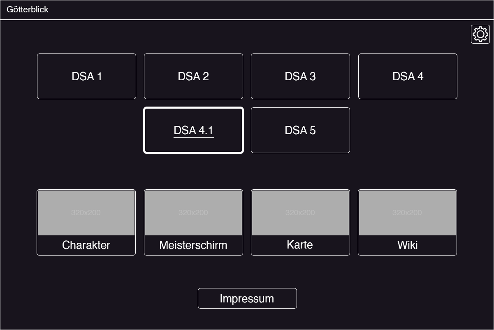
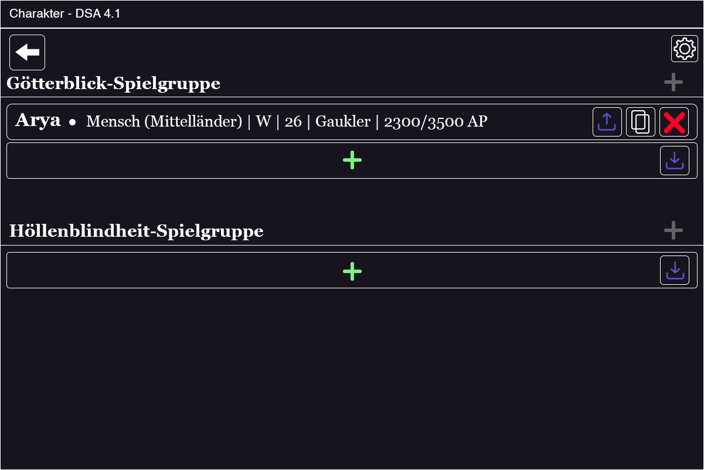
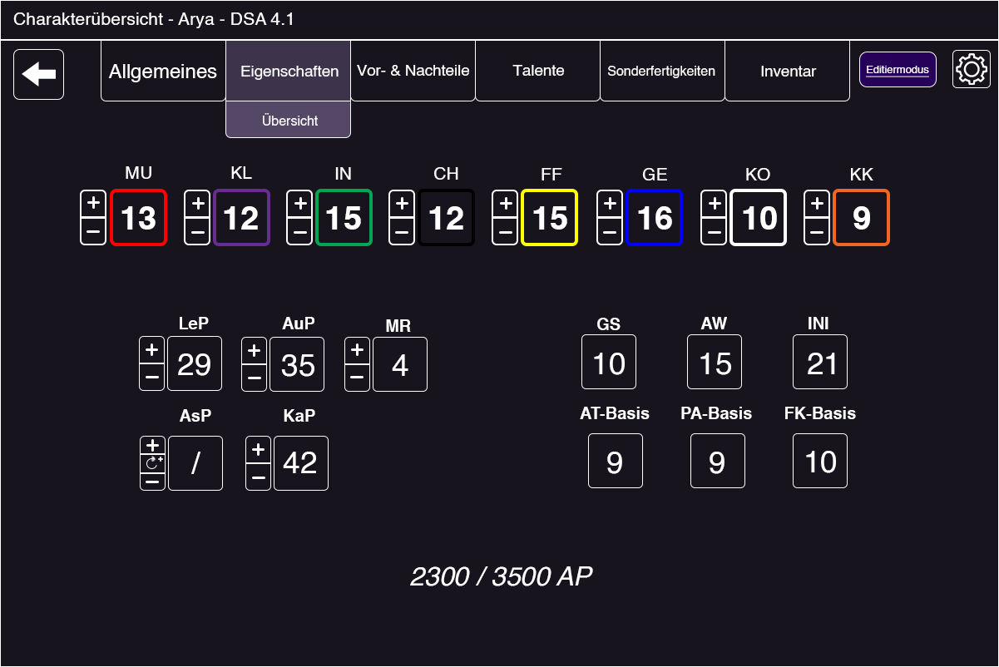
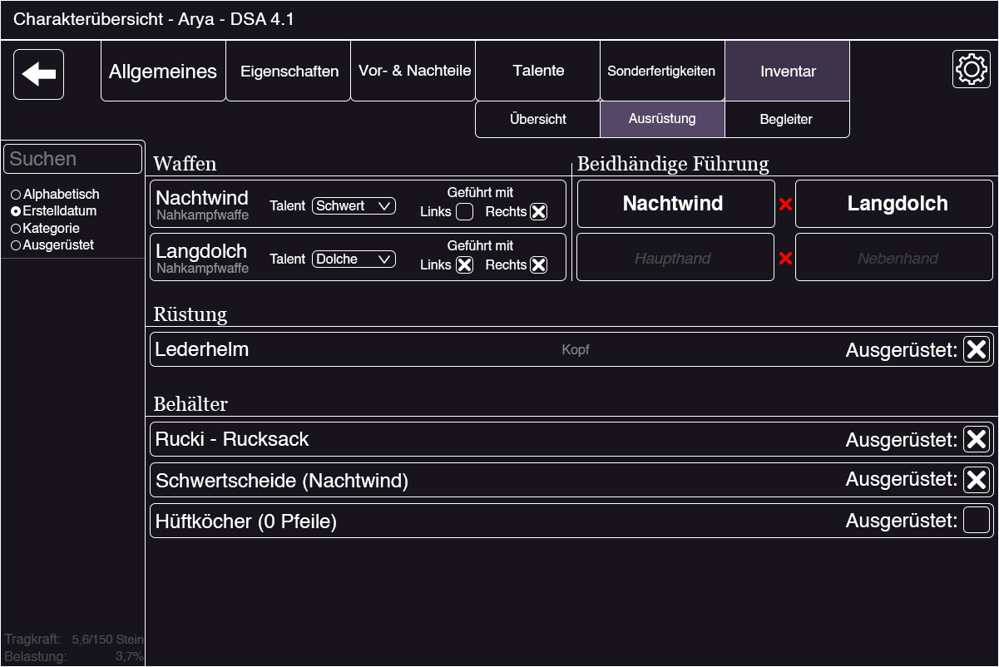

<h1 style="text-align: center;"> Götterblick Notizen </h1>

Einteilung in Module: Charakter, Meisterschirm, Wiki, Karte (Avespfade), Impressum

## **Charakter**

- Übersicht
    - Gruppieren
- Erstellen/Bearbeiten (Toggle Bearbeiten & Leveln)
    - Archetypen oder eigener Held
    - Regelauswahl
    - Grundwerte (GP-Start, Eigenschaften Max)
    - Rasse, Kultur & Varianten
    - Professionen (BgB & Veteran)
    - Name, Alter, Erscheinungsbild
    - Vorauswahl (Verbilligt oder geschenkte Sachen)
    - Eigenschaften, Vor- & Nachteile, Sonderfertigkeiten & Zauber, Talente
    - Verbindungen
    - Einfacher Modus
        - Nachteile senken
        - Sonderfertigkeiten, Zauber und Liturgien kaufen
        - Eigenschaften und Talente Steigern
        - Kampfwerte verteilen
        - Inventar Managen
        - Spätweihe, Karmalqueste, Grosse Meditation
        - Abenteuer Eintragen
        - Abenteuer bestritten (Auswahl an LeP, AP, AsP, SE und so weiter)
    - Tabs
        - Allgemeines: Übersicht, Heldenbogen, Notizen
        - Eigenschaften: Übersicht
        - Vor- & Nachteile: Vorteile, Nachteile
        - Talente: Kampftalente, Allgemeine Talente
        - Sonderfertigkeiten: Sonderfertigkeiten, Zauber, Liturgien
        - Inventar: Inventar, Ausrüstung, Begleiter

## **Meisterschirm**

- Hausregeln
- Gruppieren
- Verwalten der Gruppe (Leben, Ausdauer, Belastung usw.)
- Probenübersicht (Pro Char oder pro Talent. Modifikationen, Wahrscheinlichkeit)
    - Zauber, Fernkampf, Nahkampf, Liturgien mehr Erschwernisse
- NSC Generator & Gegner Generator
- Würfeltool (d6,d10, d20, d100)
- Kampfrundentool
- Alchemie, Beschwörung, Zauberzeichen, Schmiede, Kräutersuche, Jagd, Fischen Umrechen-, Kalender usw. Tool
- Basar
    - Items mit Preisen
    - Preismodifikation
    - Tiere (Mitsamt Ausbildung und dergleichen)
- Phex Codescheibe (Chiphre)
- ~~{[("Online")]}~~

- Color palette: https://colorhunt.co/palettes/pastel
- Dukate = 25 Skrupel
- Silbertaler = 5 Skrupel
- Heller = 2.5 Skrupel
- Kreuzer = 1.25 Skrupel

## **Wiki**

- Rassen, Professionen und so weiter
- Index (wo zu finden, z.B. WdS s43ff)
    - PDF Link zum Regelwerk

## **Karte**

- Karte von Aventurien
- Städte, Dörfer, Siedlungen, Oasen
- Reiche, Politische Gebiete
- Strassen, Handelslinien
- Kraftlinien
- Routenberechnung (Avespfade)

## **Impressum**

- Rechtliche Absicherung
- Kontaktdaten (Probleme usw.)
- Lizenzen
- Ulisses

---

# Götterblick (arc42) - Introduction and Goals

The basic goal of this software/tool is to replace all previously existing tools and provide a solution that can handle
all tasks and functions while remaining in one tool. The exact functions are described above.

Inspiration for this software has been taken from the following, existing projects:

- [Meistergeister](https://meistergeister.org/)
- [Heldensoftware](https://www.helden-software.de/)
- [Heldenblatt](https://www.heldenblatt.ch/)
- [Optolith](https://optolith.app/de/)
- [Avespfade](https://avespfade.de/)
- [Dere-Globus](http://www.dereglobus.org/)

## Requirements Overview ##

### What is Götterblick? ### 

- A tool that contains a lot of useful tools for people playing the P&P DSA.
- This tool is supposed to aid either a player or a dungeon master in their adventure.
- Together with some exporting-features, this tool is supposed to be covering almost all tools that are currently
  seperated in the market.

### Main features: ###

- Character Editor:
    - Managing characters (create & edit)
    - Leveling up characters
    - Grouping characters in the overview
- Dungeon Master Screen:
    - Managing gaming sessions (create & edit)
    - Overview of npcs and enemies
    - Useful, smaller tools for QOL improvements
- Map of Aventuria:
    - All paths, cities and towns (and their names)
    - Sub-Maps of towns and cities
    - Calculators for easier traveling
- Wiki:
    - Research of enemies, races, items etc.

## Quality Goals

| Quality Goal           | Motivation and Explanation                                                                                                                                      |
|------------------------|-----------------------------------------------------------------------------------------------------------------------------------------------------------------|
| Usability              | The tool is supposed to be easy to use. Users can easily navigate and create their desired scenarios.                                                           |
| Compatability          | Given that there are multiple versions of DSA and other programs out there, we want to also include them, as to not restrict the preference of the user.        |
| Functional Suitability | The tool needs to function correctly by also acknowledging all rulebooks and calculate accordingly and correctly.                                               |
| Transferability        | The tool along with its data should be easily transferable from either Windows, Mac or Linux.                                                                   | 
| Maintainability        | Due to the different versions and homebrew rules of DSA the tools should be adaptable in their respective version for character creation and dungeon mastering. |

# Architecture Constraints

## Technical Constraints

| Constraint            | Explanation and Background                                                                                                                                                                             |
|-----------------------|--------------------------------------------------------------------------------------------------------------------------------------------------------------------------------------------------------|
| Coding Language: Java | The programm needs to be written in Java, due to the fact that both programmers want to write in / learn that language.                                                                                |
| Operating System      | Due to the fact, that this software is supposed to be usable on every operating system, special care needs to be taken when dealing with f. ex. filesystems or system-dependent environment variables. |
| JavaFX / No Swing     | To let the app appear a bit more modern, the app is supposed to be written entirely in JavaFX, not the 'old' Swing library.                                                                            |
| Licensing             | Some libraries have special licenses or agreements, which have to be taken into account, before using them. Thus special care needs to be taken, when importing dependencies from f. ex. Maven.        |

## Organisational Constraints

| Constraint             | Explanation and Background                                                                                                                                                              |
|------------------------|-----------------------------------------------------------------------------------------------------------------------------------------------------------------------------------------|
| Planning with arc42    | Due to a portion of the coders wanting to learn / get into the field of development, we have chosen to work along the arc42 template to document and log process as well as plan in it. |
| IDE                    | To have a common development-ground, the developers are advised to use the IntelliJ Community Edition, along with the same formatter.                                                   |
| SceneBuilder           | To construct new windows for the tool, the software "SceneBuilder" is to be used, as the produced .xml files are helpful in the coding process.                                         |
| Version Control System | To keep track of changes and to allow work between multiple people on this project, GIT as a VCS is used and Github as the platform for the shared code.                                |
| JUnit Tests            | Testing the tool is mostly done in Java, more specifically in so called "JUnit Tests".                                                                                                  |
| Open Source Release    | If, and only if, "Ulisses Spiele" permits the development of this tool, then this software shall be open sourced and accessible for everyone.                                           |

## Conventional Constraints

| Constraint           | Explanation and Background                                                                                                                                                                                                                              |
|----------------------|---------------------------------------------------------------------------------------------------------------------------------------------------------------------------------------------------------------------------------------------------------|
| Good Coding Practice | To keep the code easy to read and maintable, we adhere to the good coding practices, as described [in this guide](https://www.developer.com/languages/javascript/java-best-practices/).                                                                 |
| Language             | The documentation language is supposed to be English, while the 'output' language / the interface is going to be German. This is due to the fact, that most players of DSA are German, while coding can still be done with English speaking developers. |

# System Scope and Context

## Business Context

</img>

### Dungeonmaster (User) ###

The dungeon master utilizes the tool to manage and overview the group they are playing with. They also make use of the
wiki and map, to follow along in their P&P adventure. Occasionally, they also may create their own character or npc.

### Player (User) ###

The player is an attendant of a P&P group and usually / mostly utilizes the character-section and maybe the map and
wiki. The dungeon master screen is rarely or never used by them.

### Meistergeister (Third-Party System) ###

A similar tool like Götterblick but with a focus on the dungeon master, while the Götterblick software
includes both the user's expectations (f. ex. with exporting characters to VTT softwares) and also the dungeon master's.
With this connection, Götterblick is supposed to give the users the ability to still use "Meistergeister", if they wish
so.

### Heldensoftware (Third-Party System) ###

A character creation tool for DSA4.1. Characters from that tool should be importable into the Götterblick software, as
well as the other way around.

### FoundryVTT (Third-Party System) ###

FoundryVTT is a software for "virtual table top", meaning one can play with other users on a virtually a session / round
of P&P. With the multiple use cases and import as well as export features, the adaptation of that system is supposed to
be included, too.

### Optolith (Third-Party System) ###

This software is used as a DSA5 character creation tool. Characters from that tool can be exported to FoundryVTT or to a
file, so that another person can open them in their version of optolith. Their character-file is supposed to be also
editable in this Götterblick.

## Technical Context

</img>

### All Third-Party-Systems ###

As seen above, the third-party-systems are used to help / make it more comfortable for the user to import or export
characters to these specific softwares. This is done via their respective file format, thus the im- or export is done
via f. ex. .xml, .json or other formats produced by these softwares.

# Solution Strategy

## Introduction ##

| Quality Goal                                                        | Approach in Architecture                                                                                                                                                                                                                                                                        |
|---------------------------------------------------------------------|-------------------------------------------------------------------------------------------------------------------------------------------------------------------------------------------------------------------------------------------------------------------------------------------------|
| Thorough UX-Testing and Planning (Usability)                        | To mitigate errors directly from the start, planning is the best and least time consuming method before starting to code. Along with testing the UX by presenting it regularly to other people, feedback is going to be presented for further analysation.                                      |
| Inclusion of most DSA Rulebooks (Compatability)                     | By directly referring to the version-specific rulebooks the inclusion of other versions should be inherently added over time. There may be a starting focus but over time, if there are good ground architectural structures written in code, the adaptation of other version should be doable. |
| Thorough JUnit Testing of relevant Methods (Functional Suitability) | For the simpler / more mathematical functions, that may come into play in a P&P session, testing is of upmost importance, since the functionalitys correctnees needs to be guaranteed. JUnit tests are perfect for that and will be utilized.                                                   |
| Testing on other Operating Systems (Transferability)                | When working with the code, one has to keep in mind, that all operating systems should be included to work with this software. Testing along with checking on other operating systems, if the softwares functionality still persists, are the only options, to check for transferability.       |
| Good coding practices (Maintability)                                | In order to keep up a good codebase, one has to comply with patterns, good coding practices and a good amount of documenting. This lays the ground for future developers to continue the work on this project, if they wish to further develope it on their own.                                |

## Structure ##

Götterblick is a Java program, that continuously consists of these patterns:

- The version specific rulebooks lying underneath, determining the calculating methods
- The selected module, in which the selected functionalites are presented (f. ex. a map, character creation etc.)
- The ability to export parts of the software, to continue working or playing in other software
- The ability to import from other software, to continue working or playing with Götterblick

All these parts can and will be interchangable modules, so that in the future, if new version come out, the
implementation of these new rulebooks will be similar to all the other versions of DSA. Abstraction being one of the
utilized methods, to ensure this partitioning of features.

Interfaces will be utilized to create modules, which again produce screens and other sub-screens for either creation of
characters or the dungeon master screen.

## Connectivity ##

Götterblick utilizes the JavaFX library to visualize the options, the user has, and thus makes it better suitable for
the day to day tool user. Each window usually presents itself with options to click and to change to a new screen or
close the tool altogether:

</img>

---

</img>

---

</img>

---

</img>

---

</img>

---

</img>

---

</img>

---

</img>

---

</img>

---

</img>

---

</img>

---

# Building Block View

## Whitebox Overall System

***\<Overview Diagram>***

Motivation

:   *\<text explanation>*

Contained Building Blocks

:   *\<Description of contained building block (black boxes)>*

Important Interfaces

:   *\<Description of important interfaces>*

### \<Name black box 1>

*\<Purpose/Responsibility>*

*\<Interface(s)>*

*\<(Optional) Quality/Performance Characteristics>*

*\<(Optional) Directory/File Location>*

*\<(Optional) Fulfilled Requirements>*

*\<(optional) Open Issues/Problems/Risks>*

### \<Name black box 2> {#__name_black_box_2}

*\<black box template>*

### \<Name black box n> {#__name_black_box_n}

*\<black box template>*

### \<Name interface 1> {#__name_interface_1}

...

### \<Name interface m> {#__name_interface_m}

## Level 2 {#_level_2}

### White Box *\<building block 1>* {#_white_box_emphasis_building_block_1_emphasis}

*\<white box template>*

### White Box *\<building block 2>* {#_white_box_emphasis_building_block_2_emphasis}

*\<white box template>*

...

### White Box *\<building block m>* {#_white_box_emphasis_building_block_m_emphasis}

*\<white box template>*

## Level 3 {#_level_3}

### White Box \<\_building block x.1\_\> {#_white_box_building_block_x_1}

*\<white box template>*

### White Box \<\_building block x.2\_\> {#_white_box_building_block_x_2}

*\<white box template>*

### White Box \<\_building block y.1\_\> {#_white_box_building_block_y_1}

*\<white box template>*

# Runtime View

## \<Runtime Scenario 1> {#__runtime_scenario_1}

- *\<insert runtime diagram or textual description of the scenario>*

- *\<insert description of the notable aspects of the interactions
  between the building block instances depicted in this diagram.\>*

## \<Runtime Scenario 2> {#__runtime_scenario_2}

## ... {#_}

## \<Runtime Scenario n> {#__runtime_scenario_n}

# Deployment View {#section-deployment-view}

## Infrastructure Level 1 {#_infrastructure_level_1}

***\<Overview Diagram>***

Motivation

:   *\<explanation in text form>*

Quality and/or Performance Features

:   *\<explanation in text form>*

Mapping of Building Blocks to Infrastructure

:   *\<description of the mapping>*

## Infrastructure Level 2 {#_infrastructure_level_2}

### *\<Infrastructure Element 1>* {#__emphasis_infrastructure_element_1_emphasis}

*\<diagram + explanation>*

### *\<Infrastructure Element 2>* {#__emphasis_infrastructure_element_2_emphasis}

*\<diagram + explanation>*

...

### *\<Infrastructure Element n>* {#__emphasis_infrastructure_element_n_emphasis}

*\<diagram + explanation>*

# Cross-cutting Concepts {#section-concepts}

## *\<Concept 1>* {#__emphasis_concept_1_emphasis}

*\<explanation>*

## *\<Concept 2>* {#__emphasis_concept_2_emphasis}

*\<explanation>*

...

## *\<Concept n>* {#__emphasis_concept_n_emphasis}

*\<explanation>*

# Architecture Decisions

Due to the fact that other DSA tools utilize the old Swing look, we decided that the architecture should be build in:

- a typical, JavaFX based Model-View-Controller pattern and
- a factory pattern, to create the next window or generate the sites content.

Design choices were made in the process to give the user the best user experience when working with this app: The
fewest, necessary amount of clicks while also keeping the window to a modest amount of information in a "modern" look.

SQLite has been chosen as the database beneath the software to accommodate the entries and other data, while still
focusing on efficiency.

# Quality Requirements

## Quality Tree

## Quality Scenarios

# Risks and Technical Debts

| Risk                                                                                                                  | Damage                                                                     | Probability       | Consequence                                                                                                                                | Risk-reduction                                                                                                                                                                      |
|-----------------------------------------------------------------------------------------------------------------------|----------------------------------------------------------------------------|-------------------|--------------------------------------------------------------------------------------------------------------------------------------------|-------------------------------------------------------------------------------------------------------------------------------------------------------------------------------------|
| Ulisses won't accept this project being open source.                                                                  | **Medium** Motivational loss but no progress loss                       | Medium            | This project hast to switch from a public repo to a private one and can only be used internally / in private.                              | None, as this is Ulisses' decision to make.                                                                                                                                         |
| Ulisses accepts this project being open source, but they won't allow rulebook specific details to be openly viewable. | **Low** Some minor plan changes but nothing major.                      | Medium            | Some features such as descriptions in DSA4.1 won't be viewable and will constrain user experience.                                         | None, as this is Ulisses' decision to make.                                                                                                                                         |
| Github removes the repo from their site.                                                                              | **Low** Some data loss perhaps but mostly just an annoyance.            | Very Low          | We can't push to the same repo anymore and thus have to switch to a different plattform.                                                   | Have a second repo ready to push to and also keep copies of the repo locally.                                                                                                       |
| Motivation runs out                                                                                                   | **High** No project or data loss but maintainability or usability loss. | Low               | Software won't be maintained and further bug- or feature requests won't be handled.                                                        | Do breaks, take your time with coding and even if there may be a more difficult problem, try to split it up into smaller junks. Talking also mitigates unnecessary social problems. |
| The nameless one (Der Namenslose) will be released and starts tormenting the real world.                              | **Very High** A major catastrophe with vast amount of damage.           | Almost impossible | This will stop the development of this tool for quite some time. And may cause other problems, too, like demons and other weird phenomena. | Praying to the twelve and help the world rescuing adventurers with a fresh beer or wine.                                                                                            |                                                                                       

# Glossary

| Term | Definition |
|------|------------|

